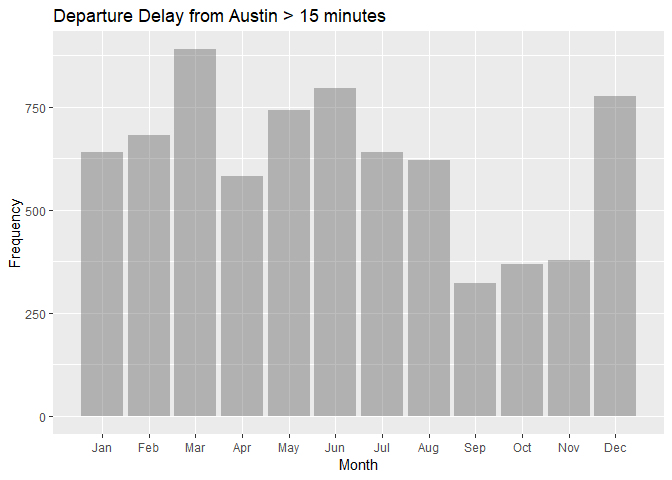
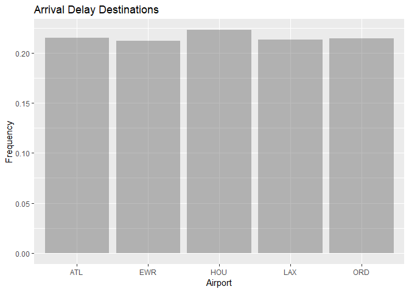
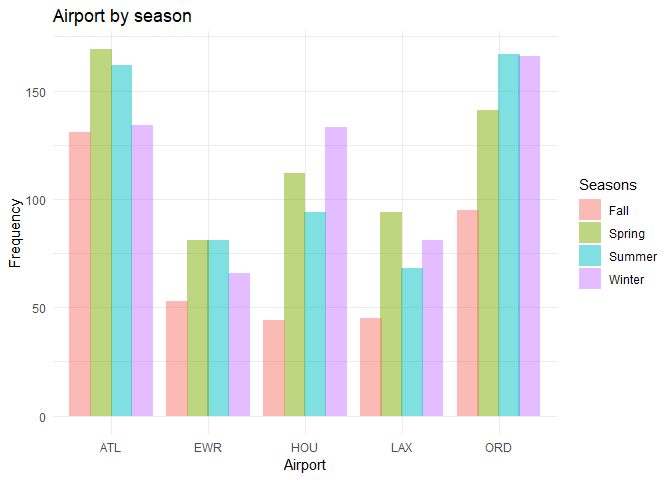
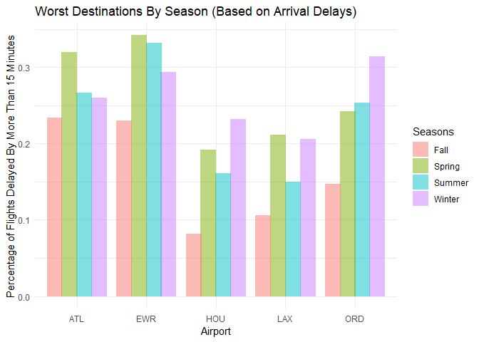

Exercise 2
================

**Intro to Predictive Modeling Exercise 2- Anuraag Mohile**
===========================================================

Flights at ABIA
---------------

Let's first see which months have the most delays 

Now, destinations with the highest percentage of delayed flights and at least 100 delayed flights

We now check the number of delayed flights by season for each of the top 5 destination airports with highest percentage of arrival delays.

Finally, the percentage of flights with arrival delays of more than 15 minutes for each of the 5 airports, by season

