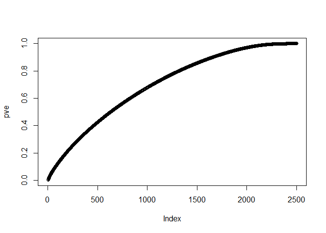
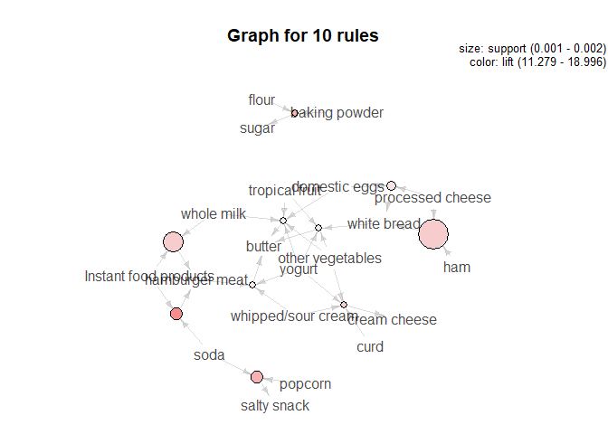

Exercise 2
================

**Intro to Predictive Modeling Exercise 2- Anuraag Mohile**
===========================================================

Flights at ABIA
---------------

Let's first see which months have the most delays 

Now, destinations with the highest percentage of delayed flights and at least 100 delayed flights

We now check the number of delayed flights by season for each of the top 5 destination airports with highest percentage of arrival delays.

Finally, the percentage of flights with arrival delays of more than 15 minutes for each of the 5 airports, by season

Author attribution
------------------

### PCA

### KNN

    [1] 0.0216

Accuracy of knn is just

    [1] 0.0216

### Multinomial Logistic Regression

Accuracy of Logistic Regression is just

    [1] 0.036

The low accuracies show the challenge of text analysis. Perhaps, adding a pseudo count for words not in training set would have improved accuracy.

Practice with association rule mining
-------------------------------------

    Apriori

    Parameter specification:
     confidence minval smax arem  aval originalSupport maxtime support minlen
            0.5    0.1    1 none FALSE            TRUE       5   0.001      1
     maxlen target   ext
         10  rules FALSE

    Algorithmic control:
     filter tree heap memopt load sort verbose
        0.1 TRUE TRUE  FALSE TRUE    2    TRUE

    Absolute minimum support count: 9 

    set item appearances ...[0 item(s)] done [0.00s].
    set transactions ...[169 item(s), 9835 transaction(s)] done [0.00s].
    sorting and recoding items ... [157 item(s)] done [0.00s].
    creating transaction tree ... done [0.00s].
    checking subsets of size 1 2 3 4 5 6 done [0.01s].
    writing ... [5668 rule(s)] done [0.00s].
    creating S4 object  ... done [0.00s].

1.  Popcorn, Soda and Salty snacks are bought together. These are all "snack" items.
2.  Baking powder, Flour and Sugar are bought together. These are used in baking.
3.  White Bread, Ham, Processed Cheese and eggs are bought together. These are breakfast items.
4.  Dairy products like curd, yogurt, cream cheese and sour cream are bought together.
